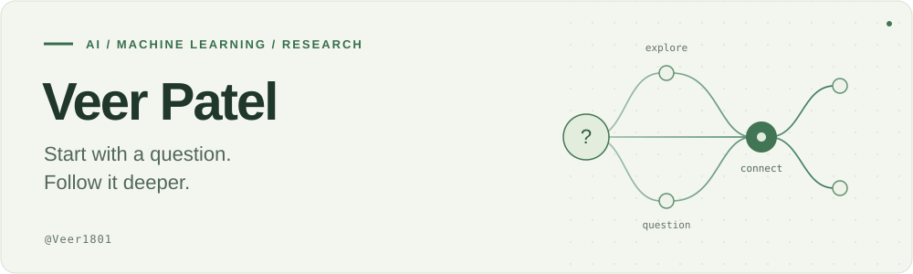

<picture>
  <source media="(prefers-color-scheme: dark)" srcset="assets/banner-dark.svg">
  <source media="(prefers-color-scheme: light)" srcset="assets/banner-light.svg">
  
</picture>

  <a href="https://www.linkedin.com/in/veerpatel1801/"><b>LinkedIn</b></a> &nbsp; · &nbsp;
  <a href="https://github.com/Veer1801/Veer1801/blob/main/resume/Veer-Patel-Resume.pdf"><b>Resume (PDF)</b></a> &nbsp; · &nbsp;
  <a href="https://leetcode.com/u/Veer_18/"><b>LeetCode</b></a> &nbsp; · &nbsp;
  <a href="mailto:veerpatel1801@gmail.com"><b>Email</b></a>

## Hi, I'm Veer.

**AI Research Engineer · Applied machine learning · Generative AI · ML systems**

I build AI systems across **computer vision, drug discovery, and LLM applications**, with **2+ years of industry experience** taking work from problem definition and data pipelines through model training, deployment, and product integration.

My work combines hands-on engineering, collaboration with domain experts, and technical leadership. I enjoy turning research ideas into software that solves a concrete problem.

[Experience](#experience) &nbsp; / &nbsp; [Selected projects](#selected-projects) &nbsp; / &nbsp; [Technical toolkit](#technical-toolkit) &nbsp; / &nbsp; [Connect](#lets-connect)

## Experience

### Nuvo AI · Software Development Engineer (AI)

*June 2024 – Present · Vapi, India*

- **Medical imaging:** led development of an orthopedic trauma AI platform processing **100,000+ X-ray images**, combining object detection, transformer classification, and hierarchical inference.
- **Drug discovery:** built generative molecular design workflows spanning pharmacophore conditioning, fragment optimization, docking, and candidate prioritization, working with structural biologists and medicinal chemists.
- **Engineering & leadership:** led a **six-person team of engineers and interns**; built distributed multi-GPU training pipelines and FastAPI services for model deployment.

### Tech Curve AI and Innovations · Product Owner & Data Scientist

*October 2023 – April 2024 · Remote, Bangkok-based team*

- Built a **LLaMA-based resume ranking engine**, reducing recruiter screening time by **approximately 70%**.
- Owned product workflows and backend architecture for HR automation; developed NLP pipelines for document parsing, semantic matching, and vendor recommendations.

## Selected projects

### [IssuePilot](https://github.com/Veer1801/IssuePilot)

A local workbench that turns GitHub issue reports into **reviewable category suggestions, missing-detail checks, and follow-up drafts**. Built with **React, TypeScript, FastAPI, and SQLite**, with optional local Laya classification.

Includes human review, version-checked updates, audit history, safe Markdown rendering, and automated API and browser tests.

[Repository and screenshots](https://github.com/Veer1801/IssuePilot) &nbsp; · &nbsp; [Architecture](https://github.com/Veer1801/IssuePilot/blob/main/docs/architecture.md)

### Equity Research AI Tool

Question answering over financial news and reports using **LangChain and Mistral**, with document ingestion and semantic retrieval for financial analysis.

*Applied LLM project · Described in my [resume](https://github.com/Veer1801/Veer1801/blob/main/resume/Veer-Patel-Resume.pdf).*

### Stock Market Prediction

My master's thesis explored financial time-series forecasting with **LSTM, Random Forest, and MLP models**, including feature engineering and comparative model evaluation.

*Master's thesis · Described in my [resume](https://github.com/Veer1801/Veer1801/blob/main/resume/Veer-Patel-Resume.pdf).*

### [DAG-ViT](https://github.com/Veer1801/DAG-ViT)

A research proposal exploring **adaptive image tokenization and directed graph reasoning** in vision transformers. The mathematical formulation and paper are available; implementation and empirical validation are future work.

[Repository](https://github.com/Veer1801/DAG-ViT) &nbsp; · &nbsp; [Research paper](https://github.com/Veer1801/DAG-ViT/blob/main/DAG_VIT_PAPER.pdf)

## Technical toolkit

- **Languages & ML:** Python, SQL, JavaScript · PyTorch, TensorFlow, scikit-learn, OpenCV
- **Generative AI:** Hugging Face, Transformers, LangChain, RAG, PEFT, QLoRA
- **Training & deployment:** DeepSpeed, Accelerate, FastAPI, Docker, MLflow, AWS S3/EC2

<b>Engineering depth — from datasets to serving</b>

My work includes modular pipelines for data ingestion, preprocessing, distributed training, inference, and REST APIs. I've used MinIO/S3, caching, and fault-tolerant data loading to support large datasets, and FastAPI with Pydantic for backend services.

I also work with model evaluation, ONNX, NVIDIA Triton Inference Server, and BentoML. Technical planning, code reviews, and collaboration with scientific and clinical teams are part of how I deliver projects.

<b>Research interests — questions I keep exploring</b>

I'm interested in efficient vision models, structured reasoning, generative molecular modeling, and LLM/VLM agents. I want to understand when an architectural idea improves a useful outcome, and when the simpler baseline is enough.

My approach: make assumptions explicit, define a fair comparison, examine failure cases, and revise the idea based on evidence.

<b>Education & academic recognition</b>

- **M.Tech, Computer Science Engineering (AI & ML)** — Ajeenkya D.Y. Patil University, 2021–2023 · **CGPA 9.02 · Gold medalist, ranked 1st**
- **B.Tech, Electronics & Telecommunication Engineering** — A.D. Patel Institute of Technology, 2017–2021
- **Publication:** *Different Approaches to Stock Market Prediction Using AI*

## Let's connect

Interested in **AI/ML engineering, applied AI, and research engineering opportunities**, and conversations about building useful AI systems.

[LinkedIn](https://www.linkedin.com/in/veerpatel1801/) &nbsp; · &nbsp; [View my resume](https://github.com/Veer1801/Veer1801/blob/main/resume/Veer-Patel-Resume.pdf) &nbsp; · &nbsp; [LeetCode](https://leetcode.com/u/Veer_18/) &nbsp; · &nbsp; [Email me](mailto:veerpatel1801@gmail.com)
